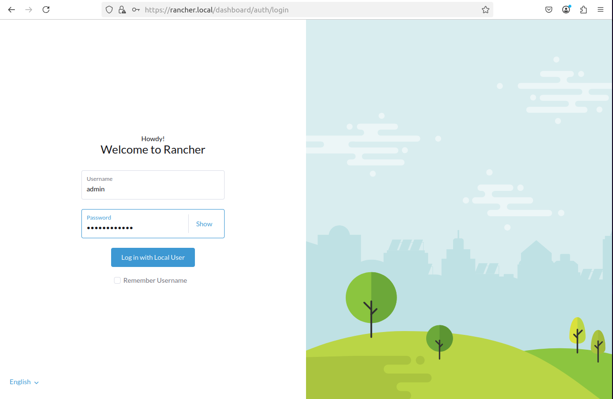

# vagrant-rancher-k8s
A provisioning project to run Kubernets cluster with Rancher, Docker in VirtualBox machines with Vagrant automation

## Install requirements
Install the requirements below
- [virtualbox](https://www.virtualbox.org/wiki/Downloads)
- [vagrant](https://developer.hashicorp.com/vagrant/docs/installation)

## Create virtual machines

```
git clone https://github.com/samukasmk/vagrant-rancher-k8s.git
cd vagrant-rancher-k8s
```

## Provisioning machines
> Tip💡: Open virtualbox manager to follow the changes made by vagrant

### rancher-server
```
vagrant up rancher
```

### kubernets master (a)
```
vagrant up k8s-master-a
```

### kubernets worker (1)
```
vagrant up k8s-worker-1
```

### kubernets worker (2)
```
vagrant up k8s-worker-2
```

### kubernets worker (3)
```
vagrant up k8s-worker-3
```

## Startup rancher-server
- The rancher server will be started by vagrant scripts in: ./scripts/rancher-server.sh
- Wait by the process execution
- At the final of command `vagrant up rancher` will be displayed in outoput: `Bootstrap Password: <generated rancher password>`
- Copy this generated rancher password. It will be necessary for next step


## Access rancher dashboard
- Execute the command below to add in your local `/etc/hosts` file to access `rancher dashboard` (without DNS) for learning porpouses:
```sh
sudo su 
echo "

# rancher nodes
192.168.1.240 rancher      rancher.local
192.168.1.241 k8s-master-a k8s-master-a.local
192.168.1.251 k8s-worker-1 k8s-worker-1.local
192.168.1.252 k8s-worker-2 k8s-worker-2.local
192.168.1.253 k8s-worker-3 k8s-worker-3.local

" >> /etc/hosts
```

- Access rancher dashboard by url [https://rancher.local/](https://rancher.local/)

- Because the cert is not valid you need to accept risk:


- Change admin password as rancher server will be asked to you
- Login as admin


## Create cluster
- After you have logged in `rancher dashboard` click in `Create`


- Select for Type: `rke1` if you want your kubernetes cluster managing containers by `docker`
> I prefer this optional if you are learning to bne simplier to see and understand where the container pods are in kubernetes nodes


- Define a cluster name


## Register nodes
- After create a cluster access area of `Registring node` and specify nodes to register with below instructions:


### Registring node: k8s-master-a


#### Registration -> Step 1

- Node role: [**X**] **etcd**, [**X**] **Control Plane**, [**X**] **Worker**

#### Registration -> Step 2

- Node Name: (empty)
- Node Public IP: 192.168.1.241
- Node Private IP: 192.168.1.241

#### Registration -> Step 3

- Registration Command
[**copy:** sudo docker command] 

```sh
vagrant ssh k8s-master-a
[**paste:** sudo docker command]
```

### Registring node: k8s-worker-1


#### Registration -> Step 1
- Node role: [ ] etcd, [ ] Control Plane, [**X**] **Worker**

#### Registration -> Step 2

- Node Name: (empty)
- Node Public IP: 192.168.1.251
- Node Private IP: 192.168.1.251

#### Registration -> Step 3

- Registration Command
[**copy:** sudo docker command] 

```sh
vagrant ssh k8s-worker-2
```

[**paste:** sudo docker command]

### Registring node: k8s-worker-2


#### Registration -> Step 1
- Node role: [ ] etcd, [ ] Control Plane, [**X**] **Worker**

#### Registration -> Step 2

- Node Name: (empty)
- Node Public IP: 192.168.1.252
- Node Private IP: 192.168.1.252

#### Registration -> Step 3

- Registration Command
[**copy:** sudo docker command] 

```sh
vagrant ssh k8s-worker-2
```

[**paste:** sudo docker command]

### Registring node: k8s-worker-3


#### Registration -> Step 1
- Node role: [ ] etcd, [ ] Control Plane, [**X**] **Worker**

#### Registration -> Step 2

- Node Name: (empty)
- Node Public IP: 192.168.1.253
- Node Private IP: 192.168.1.253

#### Registration -> Step 3

- Registration Command
[**copy:** sudo docker command] 

```sh
vagrant ssh k8s-worker-2
```

[**paste:** sudo docker command]